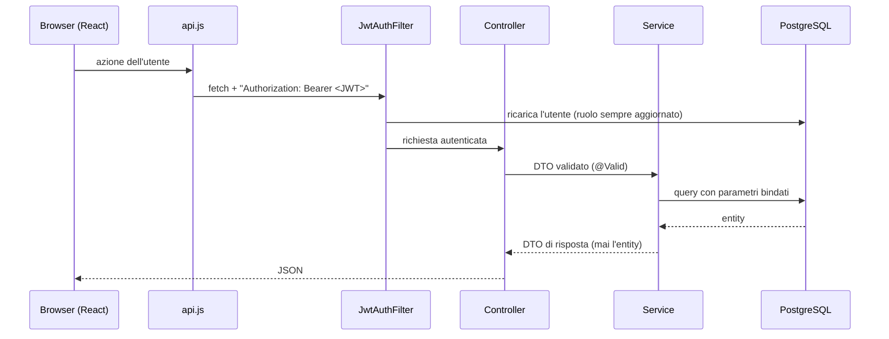
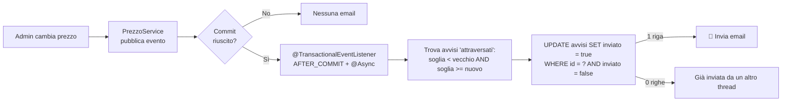

# 🚗 CarCatalog — auto usate con avvisi di prezzo


> **CarCatalog** è un catalogo di auto usate in cui chiunque può cercare e filtrare gli annunci, mentre gli utenti registrati salvano i preferiti e ricevono **un'email nel momento in cui il prezzo di un'auto scende sotto la soglia che hanno scelto**.

Ho costruito questo progetto come capstone del percorso **Full Stack Developer di Epicode**. Non volevo fare "l'ennesimo CRUD": volevo un'app con un problema vero da risolvere. L'idea degli avvisi di prezzo nasce da una domanda semplice: *come faccio a mandare una sola email, al momento giusto, senza doppioni, anche se l'amministratore cambia il prezzo due volte in un secondo?* Rispondere bene a questa domanda mi ha costretto a ragionare su transazioni, eventi, concorrenza e sicurezza, cioè su tutto quello che separa un esercizio da un'applicazione pronta per la produzione.

---

## 🚀 Tecnologie e strumenti

### Backend
| Tecnologia | Perché l'ho scelta |
|---|---|
| **Java 25 + Spring Boot 4** | Framework maturo e standard in ambito enterprise. Mi ha dato dependency injection, gestione delle transazioni ed eventi già pronti, così mi sono concentrato sulla logica di business. |
| **Spring Security + JWT** | Autenticazione stateless: il server non conserva sessioni e il frontend può stare su un dominio diverso. Nel token metto solo l'id utente, nient'altro. |
| **Spring Data JPA / Hibernate** | Accesso al database con repository dichiarativi. Per le operazioni critiche uso query `UPDATE` scritte a mano, per avere il controllo totale sull'atomicità. |
| **Flyway** | Lo schema del database è versionato (`V1`…`V4`): chiunque cloni il progetto ottiene esattamente le stesse tabelle, con dati demo inclusi. |
| **Spring Mail (Gmail SMTP)** | Invio delle notifiche di prezzo e del link "password dimenticata". |
| **JUnit 5 + Mockito + H2** | 37 test: unitari e di integrazione, questi ultimi sull'app avviata davvero e chiamata via HTTP. |

### Frontend
| Tecnologia | Perché l'ho scelta |
|---|---|
| **React 19 + Vite** | Componenti riutilizzabili e un dev server istantaneo. |
| **Tailwind CSS 4** | Design system coerente definito una volta sola con `@theme` (colori, font, raggi), senza file CSS sparsi. |
| **React Router 7** | Navigazione SPA. **I filtri della ricerca vivono nell'URL**, quindi una ricerca si può condividere o salvare nei preferiti del browser. |
| **Motion** | Animazioni leggere su card, filtri e pannelli, per un'interfaccia viva ma non invadente. |

### Database e infrastruttura
| Strumento | Ruolo |
|---|---|
| **PostgreSQL** | Database relazionale: i vincoli `UNIQUE` e le foreign key proteggono l'integrità anche se il codice sbaglia. |
| **Render** (`render.yaml` + `Dockerfile`) | Deploy "Infrastructure as Code": database, backend Docker e sito statico descritti in un unico file. |
| **Wikimedia Commons API** | Foto reali delle auto, con licenza libera e attribuzione dell'autore. |
| **Git & GitHub** | Versionamento del codice. `.env` e segreti sono esclusi con `.gitignore`. |
| **IntelliJ IDEA** | IDE per backend e frontend, con run configuration condivise nella cartella `.run/`. |

---

## ⚙️ Funzionalità

### 👀 Visitatore (senza account)
- Sfoglia il catalogo con **foto reali**, in vista **lista o griglia**.
- **Ricerca e filtri combinabili**: testo libero, marca (con il numero di auto per marca), fascia di prezzo, anno minimo, chilometri massimi.
- **Ordinamento** per prezzo, anno, chilometri, marca o data, con paginazione.
- Scheda dettaglio con crediti fotografici.

### 👤 Utente registrato
- ❤️ **Preferiti**: salva le auto che ti interessano.
- 🔔 **Avvisi di prezzo**: scegli una soglia e ricevi **un'email solo quando il prezzo la attraversa** verso il basso.
- 🔑 **Password dimenticata**: link monouso via email, valido 30 minuti.
- ✏️ Modifica del profilo e 🗑️ **cancellazione dell'account** (preferiti e avvisi compresi, diritto all'oblio).

### 🛡️ Amministratore
- Pannello con **statistiche**: utenti, auto pubblicate e in bozza, avvisi attivi, valore del listino, margine potenziale.
- Gestione auto: crea, modifica, **bozze** invisibili al pubblico, **prezzo d'acquisto** riservato.
- Cambio prezzo rapido dalla tabella: se il prezzo scende sotto una soglia, **gli avvisi partono in automatico**.
- 📷 Pulsante **"Cerca foto su Wikimedia"**: il backend trova una foto con licenza libera e ne compila l'attribuzione.
- Visione completa di **utenti, preferiti e avvisi** di tutti.

### 🔒 Sicurezza (sempre attiva)
- Login bloccato per **1 minuto dopo 3 tentativi falliti**, con conto alla rovescia nell'interfaccia.
- Privacy Policy e Cookie Policy **reali** e specifiche per l'app, raggiungibili da ogni pagina.

---

## 🧠 Ragionamento logico e architettura

### Struttura del codice

**Backend a livelli (Controller → Service → Repository)**, ogni livello con una sola responsabilità:

```
backend/src/main/java/it/carcatalog/
├── web/          → Controller REST: ricevono DTO validati, non contengono logica
├── service/      → Logica di business e confini delle transazioni
├── repository/   → Accesso ai dati (Spring Data + query atomiche scritte a mano)
├── model/        → Entity JPA (mai esposte direttamente al client)
├── dto/          → Record Java per input/output, con Bean Validation
├── event/        → Eventi di dominio e listener asincroni (email)
├── security/     → JWT, filtro di autenticazione, rate limiter del login
└── config/       → Database, thread pool per le email, creazione dell'admin
```

**Frontend a componenti React**:

```
frontend/src/
├── api.js        → UNICO punto da cui partono le fetch (token, errori, base URL)
├── auth/         → AuthContext: stato globale dell'utente loggato
├── components/   → Card, righe annuncio, form soglia, layout, hook riutilizzabili
└── pages/        → Una pagina per rotta (Home, Auto usate, Dettaglio, Admin…)
```

### Come viaggiano i dati



Il filtro JWT **ricarica l'utente dal database a ogni richiesta**: se un account viene cancellato o cambia ruolo, l'effetto è immediato, anche se il token non è ancora scaduto.

### Sfida n.1: una sola email, al momento giusto

Era la parte più delicata. I requisiti:
- l'email parte **solo quando il prezzo attraversa la soglia** (da sopra a uguale o sotto);
- se l'admin salva lo stesso prezzo o lo abbassa ancora, **niente email**;
- se il prezzo risale e poi riscende, **niente seconda email**;
- se il salvataggio fallisce, **niente email**;
- se Gmail è lento, **l'admin non deve aspettare**.

La soluzione combina quattro strumenti:



1. **Evento dopo il commit** (`AFTER_COMMIT`): se la transazione fallisce, il listener non parte proprio.
2. **`@Async` su un thread pool dedicato**: la risposta HTTP all'admin non aspetta il server SMTP.
3. **La condizione di "attraversamento"** sta nella query, non in un `if` sparso nel codice.
4. **Update atomico "compare-and-set"**: con due cambi di prezzo quasi simultanei, il database lascia vincere **una sola** transazione. L'email parte solo se l'update ha modificato **esattamente una riga**. Il flag viene scritto *prima* dell'invio: se Gmail fallisce la mail è persa, ma non ci sono loop né doppioni. Una scelta consapevole.

L'ho verificato con un test che lancia **4 cambi di prezzo in parallelo** e controlla che parta **una sola** email.

### Sfida n.2: sicurezza "da difendere"
- **IDOR**: ogni avviso e ogni preferito si cerca per **id e proprietario insieme**. Chiedere `/api/avvisi/13` di un altro utente restituisce **404**, esattamente come un id inesistente, quindi non si scopre nemmeno che esiste.
- **Mass assignment**: registrazione, profilo e avvisi accettano solo **DTO**. Campi aggiunti a mano nel JSON (`ruolo`, `inviato`, `userId`) vengono ignorati, e il ruolo lo decide solo il server.
- **SQL injection nell'ordinamento**: il campo arriva dal client ma viene confrontato con una **whitelist chiusa**. Un valore sconosciuto dà `400`, mai concatenazione nella query.
- **XSS**: niente `dangerouslySetInnerHTML` (lo vieta una regola ESLint del progetto) e il template HTML delle email fa l'escape di ogni valore.
- **Brute force**: 3 tentativi, poi blocco di 1 minuto. Il tentativo viene "prenotato" in modo atomico *prima* di controllare la password, così nemmeno le richieste parallele superano il limite. Il messaggio è identico che l'email esista o no.
- **Token monouso** (disattivazione avviso, reset password): 256 bit casuali. Nel database salvo solo l'**hash SHA-256**, e il token viaggia nel **fragment** dell'URL (`#token=`), così non finisce nei log dei server.
- **Log puliti**: mai password o email nei log, solo id numerici.

### Sfida n.3: ricerca con filtri combinabili
I filtri (testo, marca, prezzo min/max, anno, km) sono tutti opzionali e si combinano liberamente. Nel backend ho usato la **Criteria API di JPA**: costruisco una lista di predicati solo per i filtri presenti, tutti con **parametri bindati**. Nel frontend lo stato dei filtri **vive nell'URL** (`useSearchParams`): niente stato duplicato, e il tasto "indietro" del browser funziona. La ricerca testuale ha un **debounce** di 300 ms e le richieste superate vengono annullate con `AbortController`.

### Come ho verificato tutto
Non mi bastava "sembra funzionare". Ho scritto **37 test**, di cui **19 di integrazione** che avviano l'app reale e la chiamano via HTTP, come farebbe il frontend. Ognuno dei requisiti qui sopra ha un test dedicato: 403, 404 IDOR, ruolo ignorato, rollback senza email, email unica anche in parallelo, blocco del login, reset password monouso.

---

## 🛠️ Installazione e configurazione

### Prerequisiti
- **JDK 25** (IntelliJ può scaricarlo da *Project Structure → SDK*)
- **Node.js 20+**
- **PostgreSQL** (locale, oppure con `docker compose up -d`)

### 1. Clona il repository
```bash
git clone https://github.com/<tuo-utente>/car-catalog.git
cd car-catalog
```

### 2. Database
Crea utente e database (per esempio dal Query Tool di pgAdmin):
```sql
CREATE ROLE carcatalog LOGIN PASSWORD 'carcatalog';
CREATE DATABASE carcatalog OWNER carcatalog;
```
Le tabelle e le 18 auto demo le crea **Flyway** al primo avvio.

### 3. Variabili d'ambiente (email)
```bash
cd backend
cp .env.example .env
```
Compila `backend/.env`:
```env
MAIL_USERNAME=tuoaccount@gmail.com
MAIL_PASSWORD=la-tua-app-password   # 16 caratteri, da https://myaccount.google.com/apppasswords
```
> ⚠️ Serve una **App Password** di Google, non la password del tuo Gmail. Il file `.env` è in `.gitignore` e non va mai committato. Senza `.env` l'app funziona lo stesso, ma le email vengono solo registrate nei log.

### 4. Avvia il backend
```bash
cd backend
./mvnw spring-boot:run -Dspring-boot.run.profiles=dev     # Windows: mvnw.cmd ...
```
In IntelliJ basta la run configuration **"Avvia backend (log)"**. Il backend è su `http://localhost:8080`.

### 5. Avvia il frontend
```bash
cd frontend
npm install
npm run dev
```
Apri **http://localhost:5173**. In sviluppo Vite inoltra `/api` al backend, quindi non serve configurare nulla.

### 6. Accesso amministratore (solo sviluppo)
| Email | Password |
|---|---|
| `admin@carcatalog.local` | `admin-dev-password` |

### 7. Esegui i test
```bash
cd backend
./mvnw test     # 37 test, database H2 in memoria: non serve Docker
```

### Deploy su Render
Il file `render.yaml` crea database, backend Docker e frontend statico. Le variabili da impostare su Render sono `ADMIN_EMAIL`, `ADMIN_PASSWORD`, `MAIL_USERNAME`, `MAIL_PASSWORD`, `ALLOWED_ORIGIN` (URL esatto del frontend) e `VITE_API_URL` (URL del backend). `DATABASE_URL` e `JWT_SECRET` vengono generate da Render.

---

## 💡 Cosa ho imparato e prossimi passi

### Cosa mi porto a casa
Questo progetto mi ha insegnato che **scrivere codice che funziona è solo metà del lavoro: l'altra metà è scrivere codice che funziona anche quando le cose vanno storte**. Due richieste nello stesso millisecondo, un server email che non risponde, un utente che modifica a mano il JSON o l'id nell'URL: sono tutti casi che non emergono cliccando sull'interfaccia, ma che fanno la differenza in produzione.

In particolare ho imparato a:
- ragionare in termini di **transazioni ed eventi**, non solo di "chiamo un metodo";
- usare il **database come alleato** per la concorrenza (update atomici, vincoli `UNIQUE`) invece di fidarmi solo del codice Java;
- progettare la **sicurezza fin dall'inizio** e non come ultima patch;
- **dimostrare** che il codice funziona con i test, invece di sperarlo;
- rispettare **privacy e licenze** (GDPR, attribuzione delle foto Creative Commons): anche questo fa parte del mestiere.

Il momento più soddisfacente? Vedere passare il test con 4 thread in parallelo che producono **esattamente una** email. 🎉

### Prossimi passi 🔭
- **Scalabilità del rate limiter**: oggi è in memoria (perfetto con una sola istanza); con più istanze lo sposterei su **Redis**.
- **Invio email affidabile**: una tabella "outbox" con retry controllati e un provider transazionale (Brevo, SendGrid) al posto di Gmail.
- **Upload foto** su uno storage (S3 o Cloudinary) oltre a Wikimedia.
- **Refresh token** in cookie `HttpOnly` al posto del `localStorage`.
- **Ricerca full-text** con PostgreSQL `tsvector` e ordinamento per rilevanza.
- **Test end-to-end** del frontend con Playwright e una **pipeline CI** su GitHub Actions.

---

<p align="center">
  Realizzato con ☕, tanti test e un pizzico di ostinazione durante il bootcamp <b>Epicode Full Stack Developer</b>.<br/>
  Se il progetto ti è piaciuto, lascia una ⭐!
</p>
